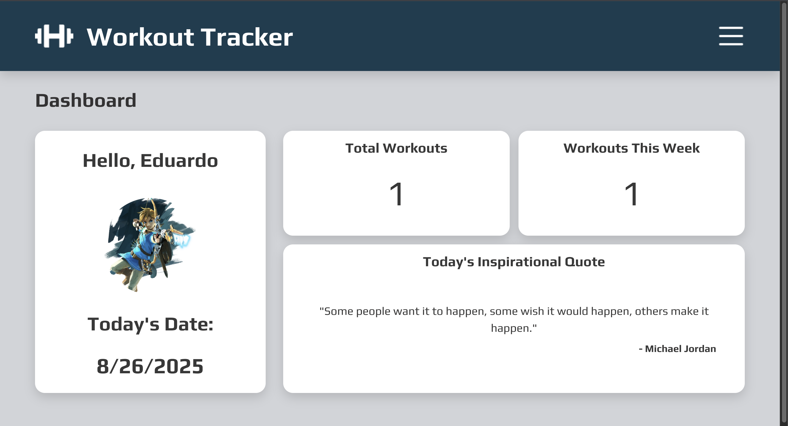

# Workout Tracker Application

## Live Demo

View the Website: [Workout Tracker Application](https://workout-tracker-2xm.pages.dev/)

## Screenshot

## Features

- **Start Workouts:** Begin new workout sessions and log exercises, sets, reps, and weights
- **Create Templates:** Build and reuse workout templates for routine convenience
- **Exercise Catalog**: Search and filter through exercises that include instructions (via ExerciseDB API)
- **Persistent Data:** Store workouts, templates, and user info in localStorage
- **Daily Motivation:** Displays a new motivational quote each day from a local JSON file
- **Responsive Design:** Desktop & Mobile-Friendly

## Tech Stack

- **Frontend:** React, TypeScript, Context API, useReducer, React Router, CSS
- **API:** ExerciseDB (via RapidAPI)
- **State Persistence:** localStorage
- **Deployment:** Cloudflare Pages with environment variable protection

## What I Learned From This Project

- **Global State Management:**
  - Implemented Context API with useReducer to manage shared state across components (Dashboard, History, Start, etc.), eliminating prop drilling and ensuring accurate synchronization of workouts and statistics.
- **Being Mindful of API Calls:**
  - Minimized external API calls by caching exercise data in localStorage, refreshing only once per day to keep exercise data and GIF URL's up to date
- **React Router Implementation:**
  - Utilized React Router to create a Single Page Application that provides seamless site navigation without need for site reloading.
- **TypeScipt Integration:**
  - Converted this application from JavaScript to TypeScript to gain hands-on experience with implementing strict typing into a React project.
  - Learned how to introduce strict typing into tools such as React hooks, event handlers, component props.
